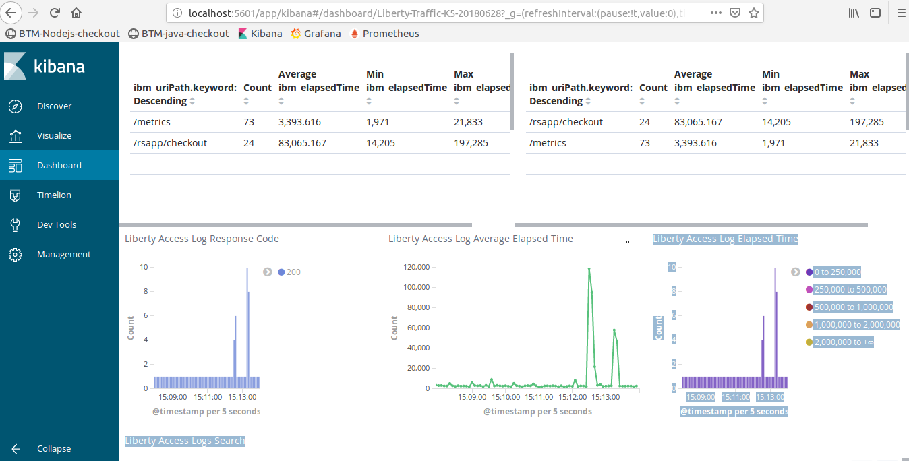

A production service should have both logging and monitoring. Monitoring provides a real-time and historical view on the system and application state, and alerts you in case a situation is met. In most cases, a monitoring alert is simply a trigger for you to start an investigation. Monitoring shows the symptoms of problems. Logs provide details and state on individual transactions, so you can fully understand the cause of problems.

Logs provide visibility into the behavior of a running app, they are one of the most fundamental tools for debugging and finding issues within your application. If structured correctly, logs can contain a wealth of information about a specific event. Logs can tell us not only when the event took place, but also provide us with details as to the root cause. Therefore, it is important that the log entries are readable to humans and machines. 

According to the [12-factor](https://12factor.net/) application guidelines, logs are the stream of aggregated, time-ordered events. A twelve-factor app never concerns itself with routing or storage of its output stream. It should not attempt to write to or manage logfiles. Instead, each running process writes its event stream, unbuffered, to stdout. If you deviate from these guidelines, make sure that you address the operational needs for logfiles, such as logging to local files and applying log rotation policies.


## Configure the logging library

Java takes a customizable and extensible approach to logging. While Java provides a basic logging API through the `java.util.logging` package, you can easily use one or more alternative logging solutions instead. In this lab we will use `java.util.logging`.

## Example implementation of logging

>Look for the complete code in `final/checkout.complete.java` in case of problems. 

Add the following line at the beginning of `src/main/java/application/rsapp/checkout.java` (after `package` statement), to load the logging module:

```java
import java.util.logging.Logger;
```

then declare `logger` at the top of the class:

```java
Logger logger = Logger.getLogger("rsapp.checkout");
```

When you want to emit the log entry, call the `logger` with appropriate log level and message:

```java
logger.info(msg);
```
or 
```
logger.severe(msg);
```

Uncomment the `logger` calls within `src/main/java/application/rsapp/checkout.java`.

Look for the complete code with logging in `final/checkout.complete.java` in case of problems. 

We recommend to format logs in JSON, so it will be easily readible for log analytics software like Elastic stack. For WebSphere Libety Profile it can be defined globally via environment variables. More information [here](https://www.ibm.com/support/knowledgecenter/en/SSEQTP_liberty/com.ibm.websphere.wlp.doc/ae/rwlp_logging.html).

Create a `server.env` file within `b2m-java` directory with the following contents:

```
WLP_LOGGING_CONSOLE_FORMAT=json
WLP_LOGGING_CONSOLE_SOURCE=message,accessLog,ffdc,trace
WLP_LOGGING_CONSOLE_LOGLEVEL=info
```

and add instruction to copy this file to the application container to `Dockerfile`:

```
COPY server.env /config/
```
Review the `src/main/liberty/config/server.xml` file. These lines are related to logging configuration:

```xml
  <logging traceSpecification="*=info"/>
   <httpAccessLogging id="accessLogging"/>
   <httpEndpoint httpPort="9080" httpsPort="9443" host="*" id="defaultHttpEndpoint" accessLoggingRef="accessLogging">
   </httpEndpoint>
 ```

 `traceSpecification` specifies the trace level and `httpAccessLogging` enables WLP access log (disabled by default).

Comapare your changes to `src/main/java/application/rsapp/checkout.java` with `final/checkout-complete.java`.
Verify your `Dockerfile` with `final/Dockerfile`.

Re-build the `target/rsapp.war` file with:

```
mvn clean install
```

## Create a Docker image for java application

Use provided `Dockerfile` to build application container:

```
cd b2m-java
docker build -t b2m-java .
```

## Integrate with the Elastic stack
The following procedure shows how to send the application logs to the local Elastic stack running in Docker.

### Deploy a local Elastic stack with Docker Compose

Steps 1-3 are already done for the lab VM and `docker-elk` repo is located in `/root/docker-elk`.

1). Clone the `docker-elk` repository from Github:

```
cd
git clone https://github.com/deviantony/docker-elk
```

2). Replace the Logstash configuration file `docker-elk/logstash/pipeline/logstash.conf` with the following code:

```
input {
    gelf { port => 5000 }
}

filter {
    json { source => "message" }
    mutate {
     gsub => [
      "level", "info", 6,
      "level", "error", 3
     ]
    }
    mutate {
     convert => { "level" => "integer" }
    }
}

output {
    elasticsearch {
        hosts => "elasticsearch:9200"
    }
    stdout { codec => rubydebug }
}
```

The above will reconfigure logstash to use `gelf` (Graylog Extended Log Format) protocol supported by Docker log driver, so we can directly stream application logs to Logstash using `gelf`.

3). Edit `docker-elk\docker-compose.yml` and modify one line:

from:

```
      - "5000:5000"
```
to
```
      - "5000:5000\udp"
```

The change above will tell `docker-compose` to expose `udp` port `5000` instead of default `tcp` (`gelf` protocol uses `udp`).

4). Start Elastic stack:
   
```
cd ~/docker-elk
docker-compose up -d
```
Expected output:
```
Creating network "docker-elk_elk" with driver "bridge"
Creating docker-elk_elasticsearch_1 ... done
Creating docker-elk_kibana_1        ... done
Creating docker-elk_logstash_1      ... done
```
5). Verify you can access Kibana on `http://localhost:5601`

### Start node.js application container and forward logs to Elastic stack

Make sure the Start application container with this command:

```
docker run --name btm-java -d -p 9080:9080 --log-driver=gelf \
--log-opt gelf-address=udp://localhost:5000 b2m-java
```

Simulate a couple fo transactions using `Firefox` or `curl` by accessing `http://localhost:9080/rsapp/checkout` and check if you can see application log records in Kibana.

In the lab vm environment, the Elastic stack has been preconfigured, so the example Dashboard and Visualizations should be available in Kibana out of the box.

You can also import Kibana configuration using provided Kibana dashboards: `ibm-open-liberty-kibana5-problems-dashboard.json` and `ibm-open-liberty-kibana5-problems-dashboard.json`

- Go to Kibana: `http://localhost:5601`
- Click on Management -> Saved Objects -> Import
- Select `btm-nodejs-kibana.json`

Simulate a couple of transactions using `Firefox` or `curl` by accessing `http://localhost:9080/rsapp/checkout` and check the Kibana dashboard: `Liberty Traffic`:


and `Liberty problems`:


